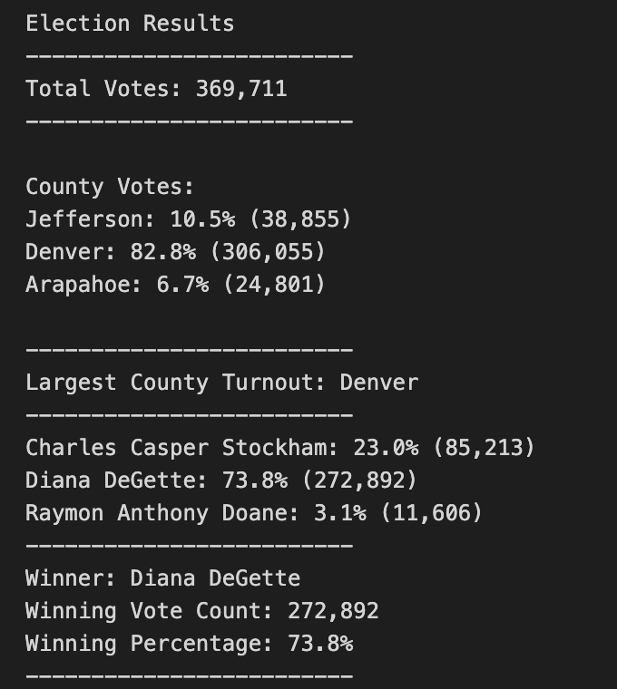

# Election Audit Analysis using Python

## Overview of Election Audit 
Assisted a Colorado Board of Elections employee, Tom, and his manager, Seth, in an election audit of the tabulated results for US congressional precinct in Colorado.

With data from the CSV file [election_results](Resources/election_results.csv), they wanted to utilize Python to create a code to find the following information:
1. Total number of votes cast in the election. 
2. List of candidates who received votes. 
3. Total number of votes each candidate received. 
4. The percentage of votes each candidate won. 
5. The winner of the election based on popular vote. 

A successful code in Python was created, which can be seen in the [PyPoll](PyPoll.py) file. 

They also wanted to create a text file to generate a vote count report to certify the US congressional race. This can be seen in the text file [election_analysis](analysis/election_analysis.txt).

Once the successful code was created, they plan to use to use the code to audit not only other congressional districts but also senatorial districts and local elections. 

However, before they implement the code to audit other districts and local elections, they have requested some additional data to complete the audit: 
* The voter turnout for each county
* The percentage of votes from each county out of the total count
* The county with the highest turnout

The purpose of this analysis is to utilize the same CSV file to update the existing code to include a county analysis. The county analysis will find the bulleted items listed directly above. In addition, the text file will be updated so that the report includes the results from the county analysis.  

## Resources Used in the County Analysis
- Data Source: [election_results](Resources/election_results.csv)
- Software: Python 3.6.7, Visual Studio Code 

## County Analysis Process 
The updated election audit code can be found in the [PyPoll_Challenge](PyPoll_Challenge.py) python file. The code will include the information from the initial analysis as well as updated code for the county analysis. The updated text file can be found in the [election_analysis](analysis/election_analysis.txt) text file. 

Please see the files above for access to the code and text file. Below is a brief description of the county analysis process. 

### County Election Results Printed To the Command Line 
To get the requested county election results, I first initialized a county list and a county vote dictionary. 

`county_list = []`

`county_votes = {}`

I then initialized an empty string to hold the county name for the county with the largest turnout.

`largest_county_turnout = ""`

I also initialized a variable that will hold the number of votes of the county that had the largest turnout.

`county_voter_turnout = 0`

Within the for loop that loops through all rows of the CSV file, which was created in the initial analysis, I wrote an If statement to ensure each unique county was added into the county list I created above. 

`if county_name not in county_list:`
   
   `county_list.append(county_name)`

Within the If statement I also initialized the county vote for each county equal to zero to begin counting the votes for each county 
  `county_votes[county_name] = 0`

Then I began to count the votes for each county by adding one vote for every time that county name appears within the For loop 

`county_votes[county_name] += 1`

Afterwards, I created another For loop to get the county names within the county dictionary. 

`for county_name in county_votes:`

Within the For loop, a initialized a variable to hold the countys' votes as they are retrieved from the county votes dictionary.
  
  `total_county_votes = county_votes.get(county_name)`

Also within the For loop, I calculated the countys' votes as a percentage of the total votes.

  `county_vote_percentage = float(total_county_votes) / float(total_votes) * 100`

To add each county's election results to the election_analysis.txt file, I created a variable variable to hold the f-strings which will output the county results. I then printed the results to the terminal.

  `county_results = (f"{county_name}: {county_vote_percentage:.1f}% ({total_county_votes:,})\n")`
    
  `print(county_results)`

Still within the For loop, I created an If statement to determine the county with the largest turnout and get its vote count. If the county's votes is creater than the current county voter turnout, then the total county votes will equal the votes of that county. This will continue until we find the county with the most amount of votes. That county will then be named the county with the largest county turnout. 
    
  `if (total_county_votes > county_voter_turnout):`

  `county_voter_turnout = total_county_votes`
        
  `largest_county_turnout = county_name`

Lastly, outside of the For loop, I printed out a statement that reveals the county that had the largest voter turnout. To do this, I initialized a variable that held the f-strings with text and also the `largest_county_turnout` string. 

`largest_county_turnout_summary = (`
        
  `f"\n"`
        
  `f"-------------------------\n"`
        
  `f"Largest County Turnout: {largest_county_turnout}\n"`
        
  `f"-------------------------\n")`

`print(largest_county_turnout_summary)`

### County Election Results Saved to a Text File 
To save the county election results in the [election_analysis](analysis/election_analysis.txt) text file:

1. I wrote a script that saves each county, the county’s total votes, and the county’s percentage of total votes to the text file, within the for loop that gets the county from the county dictionary

`txt_file.write(county_results)` 

The text file was opened before the For loop. 

2. After the For loop, I wrote script that saves the county with the largest turnout to the text file.

` txt_file.write(largest_county_turnout_summary)`

## Election Audit Results
Please see below the Election Audit Results text file, with the county analysis included. 

This information can also be seen in the terminal output once the code in the [PyPoll_Challenge](PyPoll_Challenge.py) is run. Below is the terminal output. 

The analysis of the election show that:
* There were 369,711 votes cast in the congressional election 
* The number of votes and the percentage of total votes for each county in the precinct were as follows:
    - Jefferson County had 38,855 votes which accounted for 10.5% of the total number of votes in the election. 
    - Denver County had 306,055 votes which accounted for 82.8% of the total number of votes in the election. 
    - Arapahoe County had 24,801 votes, which accounted for 6.7% of the total number of votes in the election. 
* The county that had the largest number of votes was Denver 
* The candidate results were:
  - Charles Casper Stockham received 23.0% of the vote and 85,213 number of votes.
  - Diana DeGette received 73.8% of the vote and 272,892 number of votes.
  - Raymon Anthony Doane received 3.1%% of the vote and 11,606 number of votes.
* The winner of the election was:
  - Diana DeGette, who received 73.8% of the vote and 272,892 number of votes.

## Election-Audit Summary 
Through the success of this election audit analysis, it can be proposed that the election commission adopts this code to audit the elections results in other congressional districts, senatorial districts and local elections. 

The code quickly outputs the total of votes cast, the number and percentage of votes in each county, the county with the largest turnout, the candidate results and the winning candidate. 

To be used in other elections, the code can be modified in various ways. 

### Modification 1: Loading a Different Data File 
Currently, the code utilizes the [election_results](Resources/election_results.csv) file which is specific to the tabulated results for US congressional precinct in Colorado. By changing the file path and output path, the code can be used for any election result csv file. 

The below can be a template to use when updating the file location. Where "path to" represents the location of the folder in reference to where the current .py file is saved, and "CSV File Name" is the election results CSV file to be used. 

`# Add a variable to load a file from a path.`

`file_to_load = os.path.join(path to/ "CSV File Name")`

To save the text file, the below can be used as a template. Where "path to analysis folder" is the path to the folder which will house the text file, and "election_analysis.txt" is the text file name you want to create.

`# Add a variable to save the file to a path.`

`file_to_save = os.path.join(path to analysis folder, "election_analysis.txt")`

### Modification 2: Extracting the Candidate Name and the County Name for each row 
Utilizing the [election_results](Resources/election_results.csv) file, the candidate name was in the third column and the county name was in the second column of the CSV file. However, with different data sets the columns of these items may not be the same. 

To account for this, the following can be used as a template to update the code:

`# Get the candidate name from each row.`
    
`candidate_name = row[X]`

`# 3: Extract the county name from each row.`
    
`county_name = row[Y]`

Where X is the column that has the candidate names, and Y is the column that has the county names.

### Modification 3: Changing the output text, depending on the election data
Currently the code will output a "county" analysis and a "candidate" anlysis. However, depending on the election results we want to analyze, the CSV may show different data. An example we'll use here, is instead of countys, the votes cast may be shown by cities or towns. 

Therefore, we will want to ensure the text file and the output in the terminal will say the appropriate geographical region that is being observed. 

To change this, we can change the text in the f-strings to account for the appropriate geographical region. For example, as a template, when outputting the area with the largest amount of votes for the election, we can use the template below: 

`geographical_region_turnout_summary= (`
        
`f"\n"`
        
`f"-------------------------\n"`
        
`f"Largest Geographical Region Turnout: {Geographical_Region_turnout}\n"`
        
`f"-------------------------\n")`
    
`print(geographical_region_turnout_summary)`

Where "geographical_region" represents the label of the region being observed (whether a city, town, county, etc). If the election results were a city, for example, we would change "geographical region" to "City" and the output in the text file and the output terminal would be:

`Largest City Turnout: XX`

 It is important to note for , the names of the variables within the code could also be changed (for example, changing any variable that has "county" in it to the appropriate geographical region name, such as "city"). However, this is not needed for the code to run.
